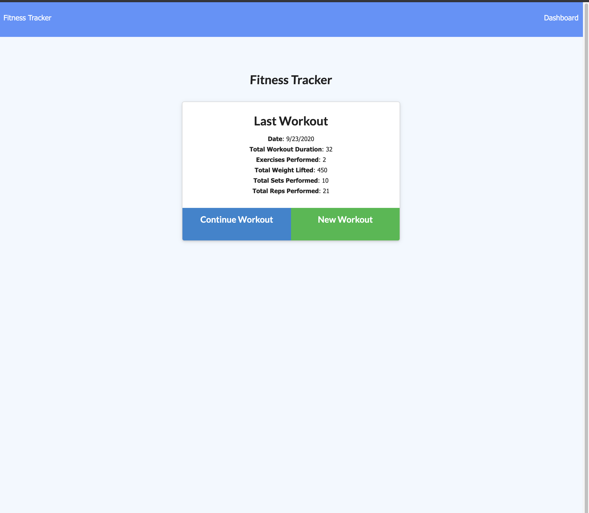
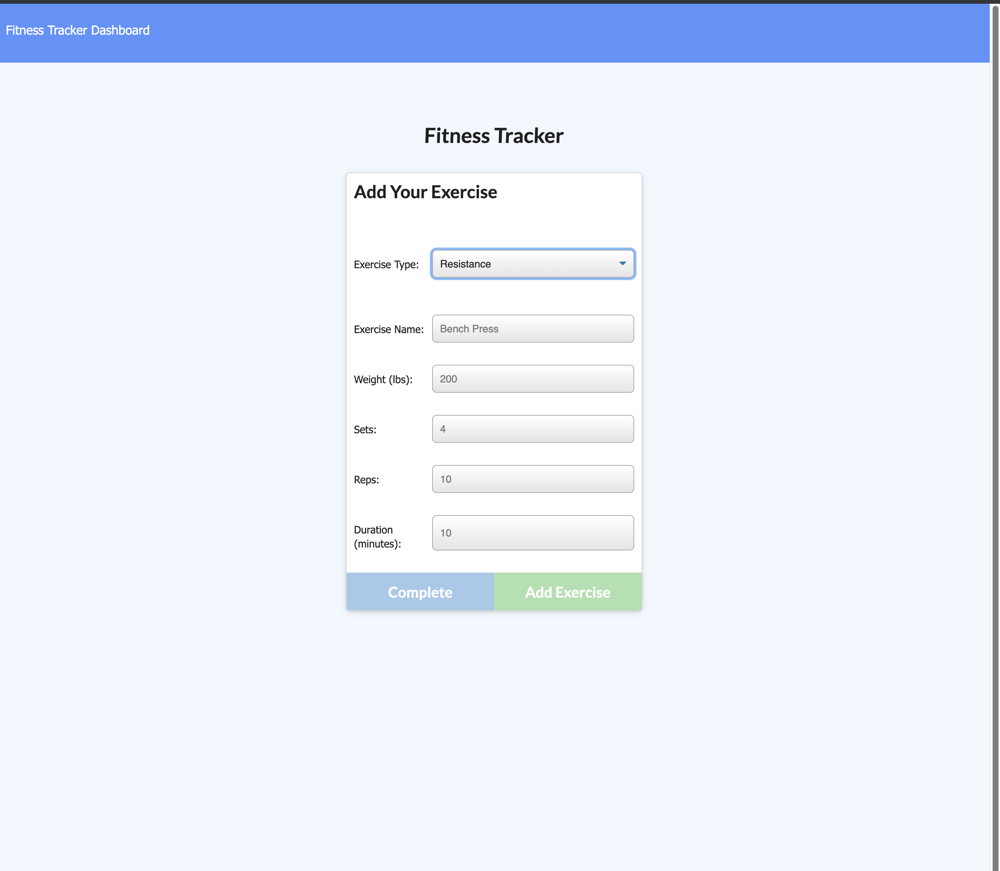
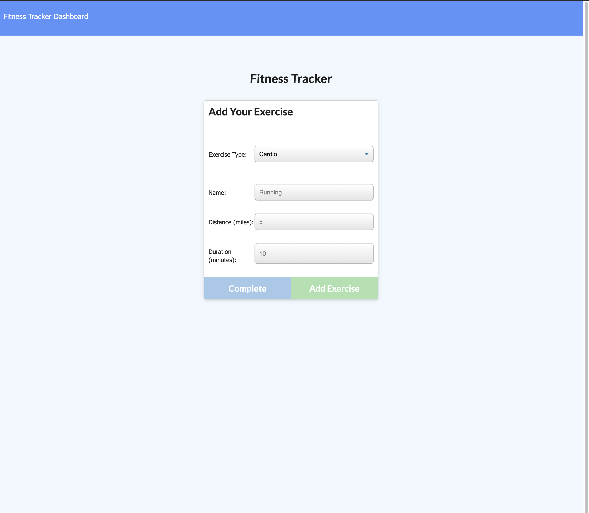
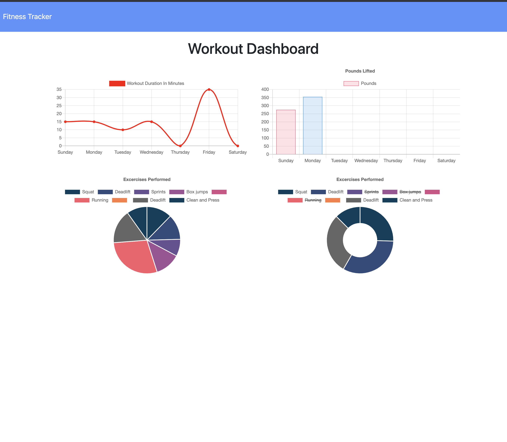

# Fitness_Tracker_Assign17

# Table of Contents:
1. [Description](#Description)
2. [Process](#Process)
3. [Issues](#Issues)
4. [Improvement](#Improvement)
5. [Link](#Link)
6. [Screenshot](#Screenshot)

# Description: 
This assignment focused on taking my newfound knowledge of working with non-SQL databases, particurarly MongoDB, and building a functioning backend for a fitness tracker. In order to do this I needed to apply my knowledge of express, mongoose, and mongoDB so that the application could allow the user to log in their workout, edit their previous workout, and be able to view their workouts via the dashboard. 

Upon logging onto the website, the user will be able to enter their workout, manually choosing whether they want to recieve responses based upon cardio or resistence. They will be able to add as many exercises as they wish to that workout. Afterwards their latest workout will be displayed on the main page, including the total duration. They can then go and create a new workout or go back and edit the previous workout (the front end will only allow them to add more exercsises during the edit). Finally they can go to the dashboard page, which will display their last week of workouts with interactive graphics. 

# Process:
* First I established a server.js which created a link to the localhost for the mongo database using boilerplate. I then created a route between the server.js and the different routing files.
* From there I created html-routes, which allowed the predesigned html documents to be displayed on the server.
* I then created the models folder, containing the workout.js which would hold the collection formatting for the documents created by the user.
* In the workout.js I created variables for new date, totalDuration (which would later be filled out via for-loop in api-routes), and an array that would host the various objects containing the different exercises the user decides to add. 
* What was left to accomplish was the api-routes:  
    - First I made sure that the database would display in the main page by creating "router.get", utilizing mongoose "find" which would display the latest workout on the main page. I would later come back and add a for loop that would add the different durations from an exercise array to display total duration. This bit of code for the for loop was made possible by fellow student Yakini, who explained that in order for the total duration to function we'd need to create a for loop.
    - Next I used "router.post" with mongoose "create" to allow the user to add entries into the database
    - In order to allow the user to update their last workout, I used "router.put" with the mongoose "findByIdAndUpdate" to select the workout desired and add extra exercises to them. 
    - Finally, in order to have the dashboard function in the front end I needed to once again use router.get and mongoose "find" but I also needed to add ".limit()" which would specify a maximum number of documents allowed to be displayed.

# Issues:
* Getting used to using backend again, have not done so for two weeks due to the 2nd project. Found myself making common mistakes, like typing "_dirname" rather than "__dirname."  
* The other major issue I encountered was getting the totalDuration to function. This again might be linked to my break from back end, because I needed to be reminded that using a for loop would be a proper solution for it

# Improvements:
There is a persisting issue that needs to be resolved, but thankfully the problem was not of my own doing. Instructor Jonathan noted that the dashboard (which was created by the school and we should not have to fix ourselves) does not function properly even with his master file. While it displays the information from the database to the dashboard thanks to my efforts in the api-routes file, whoever wrote it set it up incorrectly so that it does not properly display the workouts on the correct days (even though when checking api/workouts/range on the localhost we can see that they have the proper dates.) Please keep this in mind when grading as the instructor himself said that this was a persisting issue even with the solved file. 

# Link:
[Deployed Website](https://fitness-tracker-u-of-u.herokuapp.com/)
# Screenshots:

